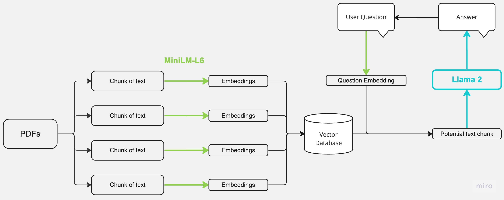

1. PDFs as Input:
Upload multiple PDF files as input.
2. Text Chunk Extraction:
Content from the PDFs is chunked into 500 words smaller chucks.
3. Embeddings with MiniLM-L6:
Each text chunk is processed using the MiniLM-L6 model to generate embeddings.
4. Vector Database:
The generated embeddings from text chunks are stored in a Vector Database.
5. Question Processing and Matching:
Upon receiving a user question:
The question is transformed into an embedding.
The question's embedding is compared with the database to find most similar text chunks.
6. LLM (Llama2) for Answer Generation:
The top 4 most similar text chunks and conversation history are sent to LLM for answer generation.